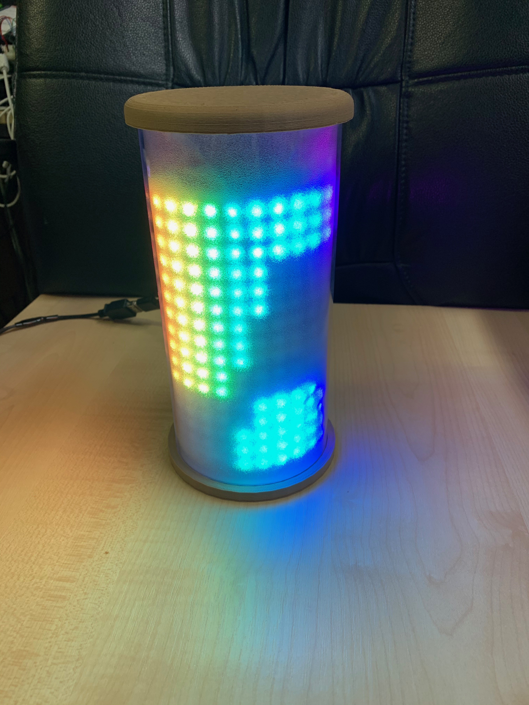
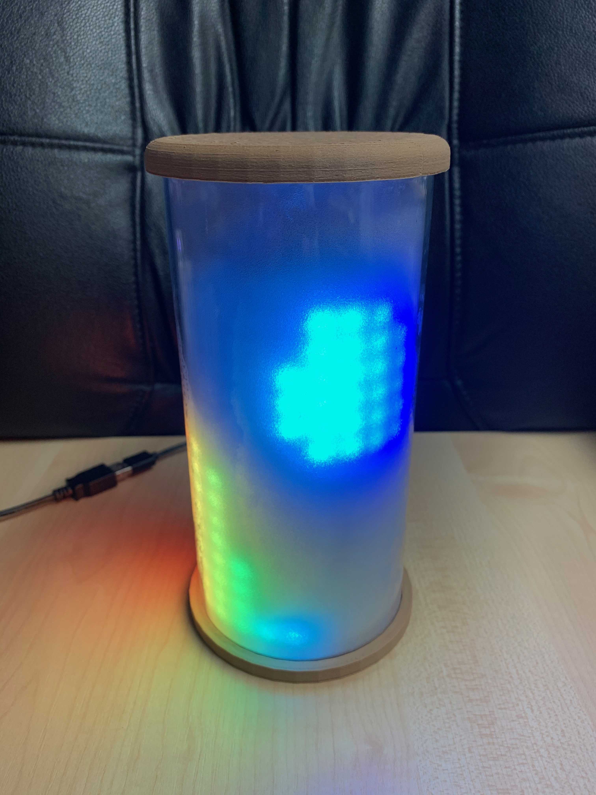

# lava-lamp-replacement #

replacement for a real "lava lamp" with a WS2812 LED matrix

For my wife, I just completed a project to replace a real lava lamp with s.th. less dangerous and dirty (just consider the mess if a real lava lamp falls to the ground and breaks...). After some experiments, I decided to realize that project with an [Espruino](https://www.espruino.com/) microcontroler driving a 16x16 matrix of WS2812 LEDs.

> This documentation is currently in progress - do not expect it to be completed before end of november.

<table>
  <tr>
    <td>

</td>
    <td>

</td>
  </tr>
  <tr>
    <td>
<b>Lava lamp in action</b>
</td>
    <td>
<b>dto., from different angle</b>
</td>
  </tr>
</table>

## License ##

[MIT License](LICENSE.md)
