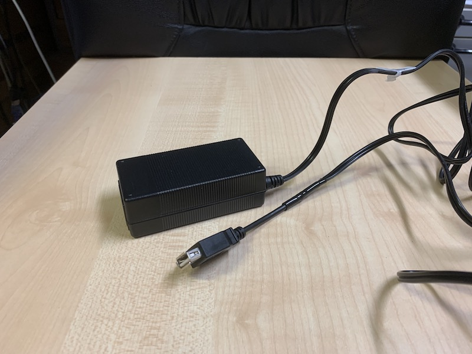

# lava-lamp-replacement #

replacement for a real "lava lamp" using a WS2812 LED matrix

For my wife, I just finished a little project to replace a real lava lamp with s.th. less dangerous and dirty (just consider the mess if a real lava lamp falls to the ground and breaks...).

After some experiments, I decided to realize that project with an [Espruino](https://www.espruino.com/) microcontroler driving a 16x16 matrix of WS2812 LEDs.

> This documentation is currently in progress - do not expect it to be completed before end of november.

<table>
  <tr>
    <td style="text-align:center"> <b>Lavalamp in action</b></td>
    <td style="text-align:center"> <b>dto., from different angle</b></td>
  </tr>
</table>

## Bill of Materials ##

<table>
  <tr>
    <td style="text-align:center"> <b>Windglass</b></td>
    <td style="text-align:center"> <b>dto., with separate Base</b></td>
  </tr>
</table>

<table>
  <tr>
    <td style="text-align:center"> <b>Espruino, packaged, top View</b></td>
    <td style="text-align:center"> <b>dto., bottom View</b></td>
  </tr>
</table>

<table>
  <tr>
    <td style="text-align:center"> <b>Espruino, packaged, top View</b></td>
    <td style="text-align:center"> <b>dto., bottom View</b></td>
  </tr>
</table>

<table>
  <tr>
    <td style="text-align:center"> <b>LED-Matrix, mounted in Ring</b></td>
    <td style="text-align:center"> <b>dto., rear View with Espruino</b></td>
  </tr>
</table>

<table>
  <tr>
    <td style="text-align:center"> <b>Lavalamp in action</b></td>
    <td style="text-align:center"> <b>dto., from different angle</b></td>
  </tr>
</table>

## License ##

[MIT License](LICENSE.md)
