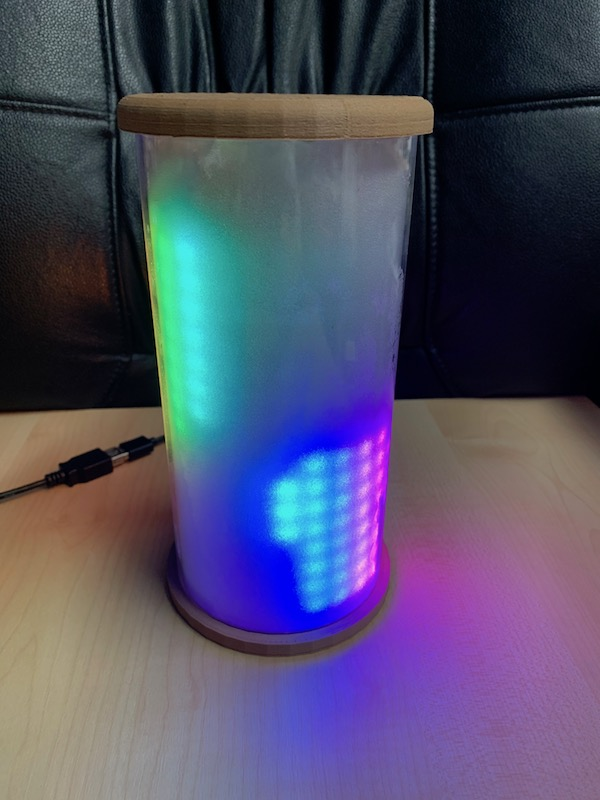
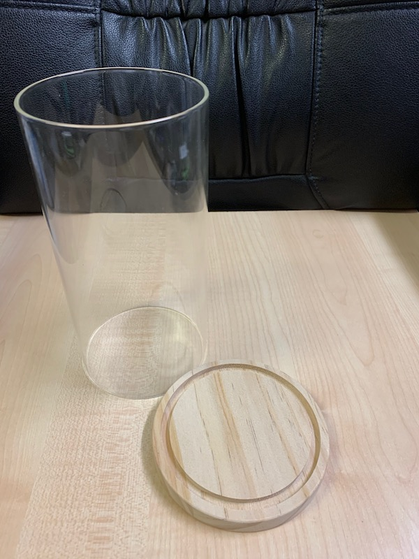
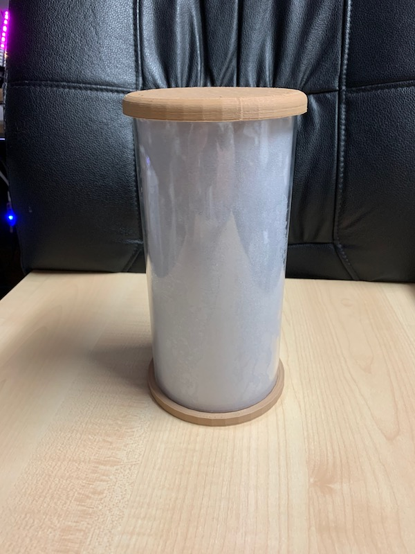
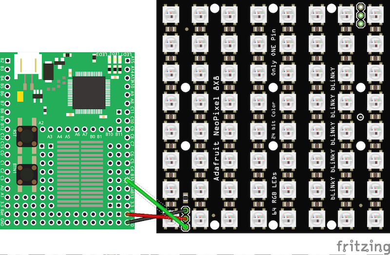

# lava-lamp-replacement #

replacement for a real "lava lamp" using a WS2812 "Neopixel" LED matrix

For my wife, I just finished a little project to replace a real lava lamp with s.th. less dangerous and dirty (just imagine the mess if a real lava lamp falls to the ground and breaks...).

After some experiments, I decided to use an [Espruino](https://www.espruino.com/) microcontroler to drive a 16x16 matrix of WS2812 LEDs.

> This documentation is currently in progress - do not expect it to be completed before end of november.

<table>
  <tr>
    <td style="text-align:center"> <b>Lavalamp in action</b></td>
    <td style="text-align:center"> <b>dto., from different angle</b></td>
  </tr>
</table>

## Bill of Materials ##

* 1x [Original Expruino](https://www.espruino.com/Original)
* 1x WS2812B 16x16 RGB LED matrix
* 1x short USB-A-to-Micro-USB adapter cable
* 1x USB-A extension cable (with an USB-A socket)
* 1x power supply 5V/1A
* 1x wind glass (e.g., 200mm tall, 100mm diameter, 2.6mm thick) or a similar translucent cylinder
* 1x frosted glass foil, self-adhesive
* 3x rubber bands, 80mm diameter
* a few mm of double-sided adhesive tape
* < 100g of filament to print 4 differents parts (see below)
* soldering tin
* a small plastic bag (see foto below)

### Tools needed ###

* Desktop computer (Windows, Linux or Mac OS) or Chromebook with a modern browser (e.g., Chrome) which supports the "Web Serial API"
* 3D printer
* soldering iron
* wire stripper
* side cutter

## Instructions ##

### Wind Glass ###

<table>
  <tr>
    <td style="text-align:center"> <b>Windglass</b></td>
    <td style="text-align:center"> <b>dto., with separate Base</b></td>
  </tr>
</table>

### Frosted Glass Foil ###

<table>
  <tr>
    <td style="text-align:center"> <b>Wind Glass with frosted Glass Foil</b></td>
  </tr>
</table>

### Preparing the Espruino ###

<table>
  <tr>
    <td style="text-align:center"> <b>Espruino, packaged, top View</b></td>
    <td style="text-align:center"> <b>dto., bottom View</b></td>
  </tr>
</table>

### Rings for the RGB LED Matrix ###

<table>
  <tr>
    <td style="text-align:center"> <b>Ring on Printbed</b></td>
    <td style="text-align:center"> <b>dto., separate</b></td>
  </tr>
</table>

### Assembling LED Matrix and Rings ###

<table>
  <tr>
    <td style="text-align:center"> <b>LED-Matrix, mounted in Ring</b></td>
    <td style="text-align:center"> <b>dto., rear View with Espruino</b></td>
  </tr>
</table>

### Lamp Base ###

<table>
  <tr>
    <td style="text-align:center"> <b>Base with Cable</b></td>
  </tr>
</table>

### Lamp Lid ###

<table>
  <tr>
    <td style="text-align:center"> <b>Lava Lamp in action</b></td>
    <td style="text-align:center"> <b>dto., from different angle</b></td>
  </tr>
</table>

### Power Supply ###

<table>
  <tr>
    <td style="text-align:center"> <b>Power Supply with modified Plug</b></td>
  </tr>
</table>

### Assembling the Lamp ###

<table>
  <tr>
    <td style="text-align:center"> <b>fully assembled Lava Lamp</b></td>
  </tr>
</table>

## 3D Prints ##

### Rings for the LED Matrix ###

<table>
  <tr>
    <td style="text-align:center"> <b>Lava Lamp Ring Model</b></td>
  </tr>
</table>

### Lamp Lid ###

<table>
  <tr>
    <td style="text-align:center"> <b>Lava Lamp Lid Model</b></td>
  </tr>
</table>

### Lamp Base ###

<table>
  <tr>
    <td style="text-align:center"> <b>Lava Lamp Base Model (top View)</b></td>
    <td style="text-align:center"> <b>dto. (bottom View)</b></td>
  </tr>
</table>

## Software ##

The software for this project runs on an [Espruino](https://www.espruino.com/), a small microcontroler which may be programmed in JavaScript. By now, there is a whole [family of Espruino boards](https://www.espruino.com/Other+Boards) from which the [Original Espruino](https://www.espruino.com/Original) has been chosen (because it was in the author's trove and has a Micro-USB socket) - but you may also use a different board as well (such as the [Espruino Pico](https://www.espruino.com/Pico), which has a smaller size but is actually more performant than the "Original") if you modify the scripts (and the wiring) accordingly.

### Getting Started with the Espruino ###

As soon as you got the Espruino board of your choice, you should work through the "Getting started" tutorial for this board (just use [the board overview](https://www.espruino.com/Other+Boards) as a starting point, click on your board and you will be directed to the related instructions)

That tutorial will tell you

* which drivers to install in order to communicate with your board (if any)
* how to use the [Espruino Web IDE](https://www.espruino.com/ide/#) and
* how to update the firmware (if that should be necessary)

For the following instructions it is assumed that you have the Web IDE running and that your board is connected to your computer.

### Wiring ###

The following image illustrates the wiring (while the shown LED matrix only contains 8x8 LEDs, the principal wiring remains the same for larger matrices as well)

<table>
  <tr>
    <td style="text-align:center"> <b>principal Wiring</b></td>
  </tr>
</table>

Simply connect

*  one of Espruino pins labelled `Bat` to `5V` on the LED matrix (red wire),
*  one of Espruino pins labelled `GND` to `GND` on the LED matrix (white wire) and
*  Espruino pin `B15` to `DIN` on the LED matrix (green wire)

If you now connect the Espruino Micro-USB socket with a computer or a 5V power supply, it will power both the Espruino itself and the LED Matrix.

### Functional Test of the LED Matrix ###

In order to test the (wiring and) LED matrix, you may copy the contents of file [LED-Function-Test.js](https://raw.githubusercontent.com/rozek/lava-lamp-replacement/main/LED-Function-Test.js) into the editor area of the Espruino Web IDE and click "Send to Espruino".

If everything works as intended, the LED matrix should display an image similar to the one shown below (taken from another project):

<table>
  <tr>
    <td style="text-align:center"> <b>LED Matrix Function Test</b></td>
  </tr>
</table>

### The actual Program ###

The actual program implements a "cellular automaton" which simulates a process similar to "thermal diffusion" - that is by no means physically correct, but looks good (which is all what counts in this context)

In order to install that program

* copy the contents of file [LavaLamp.js](https://raw.githubusercontent.com/rozek/lava-lamp-replacement/main/LavaLamp.js) into the editor area of the Espruino Web IDE
* choose `Flash` as the upload target of the IDE and
* click "Send to Espruino"

If everything works as intended, the animation should start after an initial delay of 1 second (which has been chosen in order to give Espruino enough time for its internal house keeping after the upload)

And since the code has been saved in flash memory, the animation should start automatically whenever the board is powered-on.

<table>
  <tr>
    <td style="text-align:center"> <b>Lavalamp in action</b></td>
    <td style="text-align:center"> <b>dto., from different angle</b></td>
  </tr>
</table>

#### Current Performance ####

Right now, the simulation runs with a refresh rate of approx. 1.5Hz, which seems a bit slow albeit still acceptable. Due to some bugs in the Espruino compiler, most parts of the program run without compilation - but as soon as those bugs have been fixed, the refresh rate should increase to approx. 4Hz and provide a really nice animation.

## License ##

[MIT License](LICENSE.md)
